Hardware_Software_Interface
===========================

###The program assignments of the class [Hardware/Software Interface](https://www.coursera.org/course/hwswinterface) on Coursera.

>
* Lab 0: Warm Up
  * 纯属热身
  * 基本的C语言操作
* Lab 1: Manipulating Bits Using C
  * 用位运算解决一系列问题，而且有字符数限制
  * 一些基本的数理逻辑，例如德摩根率(De Morgan's law)
* Lab 2: Disassembling and Defusing a Binary Bomb
  * 传说中的二进制炸弹
  * 各种GDB，打各种断点，查看各种寄存器内存状态，分析汇编语句，整理出结构
  * 熟悉操作系统的调用过程
  * 这个Lab是整门课最精彩的Lab
* Lab 3: Buffer Overflows and Segmentation fault
  * 传说中的缓冲区溢出攻击
  * 利用内存溢出的漏洞去攻击给你提供的可执行程序
  * 最邪恶的Lab没有之一
* Lab 4: Cache Geometries
  * 不透明的Cache，类似于Lab2的黑箱Lab
  * 逆向工程破解一个CPU的构造，通过给几个虚拟的Cache提供输入，以及Cache给你返回的Hit/Miss信息判断Cache的规格
  * 对了解Cache的结构很有帮助
* Lab 5: Writing a Dynamic Storage Allocator
  * 手写一个malloc
  * 靠！

Reference Book
--------------
[Computer Systems: A Programmer’s Perspective, 2nd Edition (CS:APP)](http://csapp.cs.cmu.edu/)

Notes
-----
####Lab1
isPower2()这个想了好久，没办法最后还是上网搜了，学习的是思路，然后自己将逻辑再优化一下，将op数减少到9个。不知道还能不能再少？
```c
bits.c
/*
 * isPower2 - returns 1 if x is a power of 2, and 0 otherwise
 *   Examples: isPower2(5) = 0, isPower2(8) = 1, isPower2(0) = 0
 *   Note that no negative number is a power of 2.
 *   Legal ops: ! ~ & ^ | + << >>
 *   Max ops: 20
 *   Rating: 4
 */
int isPower2(int x) {
 return !(!x|x>>31 | x&x+~0);
}
```
相对来说，经过之前各种位操作的折磨洗礼后，再看pointer这个就显得比较简单了。同样是最后一题，会发现容易很多。
```c
pointer.c
/*
 * Return x with the n bits that begin at position p inverted (i.e.,
 * turn 0 into 1 and vice versa) and the rest left unchanged. Consider
 * the indices of x to begin with the low-order bit numbered as 0.
 */
int invert(int x, int p, int n) {
	// TODO
	int mask=1<<31>>32+~(p+n) ^ ~0<<p;
	return x^mask;
}
```
注：不要吐槽括号少，因为操作数优先级的缘故，括号能省就省了。

####Lab2
我能说，我看汇编代码看的确实捉急，奈何功力尚浅有表示膜拜大神，搜索不是我的本意但我还是拼尽全力，学到了很多一言难尽彻夜难眠啊，故此lab详细记录。
这里就用官方文档推荐的三个工具：
>
* gdb
* objdump
* strings

当然你也可以使用xxd，hexdump，ndisasm，高大上的ida等其他工具啦。

#####0x00 Bomb
先让我们对bomb这个可执行文件来个整体认识。<br>
运行：


显示文件中的可打印字符<br>
`strings -t x bomb`


输出目标文件的符号表<br>
`objdump -t bomb`

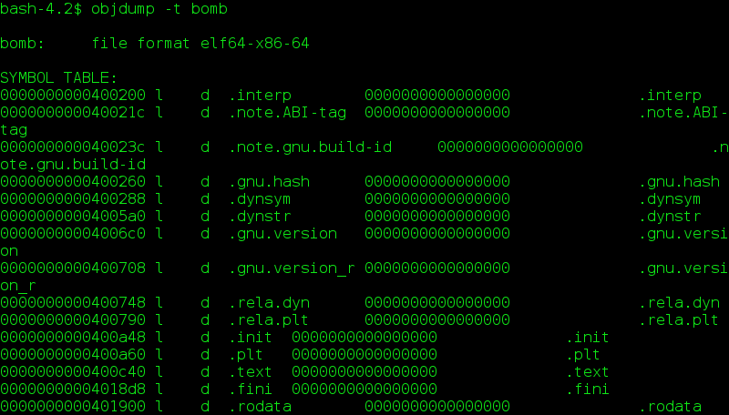

反汇编指令机器码的section<br>
`objdump -d bomb`

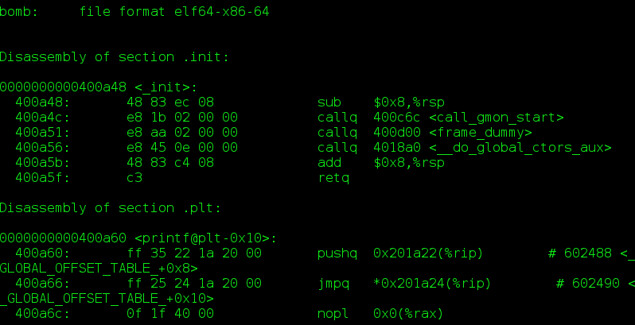

从反汇编代码中就可以看到我们要解决的就是6个phase。

#####0x01 Defuse
`Phase 1`<br>
先看phase1的反汇编代码：
```asm
0000000000400e70 <phase_1>:
  400e70:	48 83 ec 08          	sub    $0x8,%rsp
  400e74:	be f8 1a 40 00       	mov    $0x401af8,%esi
  400e79:	e8 bf 03 00 00       	callq  40123d <strings_not_equal>
  400e7e:	85 c0                	test   %eax,%eax
  400e80:	74 05                	je     400e87 <phase_1+0x17>
  400e82:	e8 b6 07 00 00       	callq  40163d <explode_bomb>
  400e87:	48 83 c4 08          	add    $0x8,%rsp
  400e8b:	c3                   	retq   
```
从上面汇编代码可以看到`400e79`处调用了函数`<strings_not_equal>`，看名字就知道该函数作用就是判断字符串是否相等，如果不相等则调用`<explode_bomb>`函数引爆bomb。<br>
所以我们往上找传递的参数，`400e74`处的`mov $0x401af8,%esi`显然传入的就是要对比的字符串，并且还是硬编码到代码里，所以直接`strings -t x bomb | grep 1af8`就出来了。


下图是cmu的bomb反汇编代码，稍许不同，整体一样。因为图上注释的比较详细，故引用于此。


`Phase 2`<br>
呃，好吧，代码变长了。
```asm
0000000000400e8c <phase_2>:
  400e8c:	48 89 5c 24 e0       	mov    %rbx,-0x20(%rsp)
  400e91:	48 89 6c 24 e8       	mov    %rbp,-0x18(%rsp)
  400e96:	4c 89 64 24 f0       	mov    %r12,-0x10(%rsp)
  400e9b:	4c 89 6c 24 f8       	mov    %r13,-0x8(%rsp)
  400ea0:	48 83 ec 48          	sub    $0x48,%rsp
  400ea4:	48 89 e6             	mov    %rsp,%rsi
  400ea7:	e8 97 08 00 00       	callq  401743 <read_six_numbers>
  400eac:	48 89 e5             	mov    %rsp,%rbp
  400eaf:	4c 8d 6c 24 0c       	lea    0xc(%rsp),%r13
  400eb4:	41 bc 00 00 00 00    	mov    $0x0,%r12d
  400eba:	48 89 eb             	mov    %rbp,%rbx
  400ebd:	8b 45 0c             	mov    0xc(%rbp),%eax
  400ec0:	39 45 00             	cmp    %eax,0x0(%rbp)
  400ec3:	74 05                	je     400eca <phase_2+0x3e>
  400ec5:	e8 73 07 00 00       	callq  40163d <explode_bomb>
  400eca:	44 03 23             	add    (%rbx),%r12d
  400ecd:	48 83 c5 04          	add    $0x4,%rbp
  400ed1:	4c 39 ed             	cmp    %r13,%rbp
  400ed4:	75 e4                	jne    400eba <phase_2+0x2e>
  400ed6:	45 85 e4             	test   %r12d,%r12d
  400ed9:	75 05                	jne    400ee0 <phase_2+0x54>
  400edb:	e8 5d 07 00 00       	callq  40163d <explode_bomb>
  400ee0:	48 8b 5c 24 28       	mov    0x28(%rsp),%rbx
  400ee5:	48 8b 6c 24 30       	mov    0x30(%rsp),%rbp
  400eea:	4c 8b 64 24 38       	mov    0x38(%rsp),%r12
  400eef:	4c 8b 6c 24 40       	mov    0x40(%rsp),%r13
  400ef4:	48 83 c4 48          	add    $0x48,%rsp
  400ef8:	c3                   	retq   
```
这关的hint是loops。看不出来循环体，没事，我们慢慢来。<br>
一开始的都是一些传递参数的操作，这个先不管。<br>
到了`400ea7`处调用`<read_six_numbers>`函数，看这个也就知道了我们要输入六个数字。

接下来再看循环体，往回jmp的就是循环体。
```asm
  400eba:	48 89 eb             	mov    %rbp,%rbx
  400ebd:	8b 45 0c             	mov    0xc(%rbp),%eax
  400ec0:	39 45 00             	cmp    %eax,0x0(%rbp)
  400ec3:	74 05                	je     400eca <phase_2+0x3e>
  400ec5:	e8 73 07 00 00       	callq  40163d <explode_bomb>
  400eca:	44 03 23             	add    (%rbx),%r12d
  400ecd:	48 83 c5 04          	add    $0x4,%rbp
  400ed1:	4c 39 ed             	cmp    %r13,%rbp
  400ed4:	75 e4                	jne    400eba <phase_2+0x2e>
```
每次%rbp加4，然后判断%r13和%rbp是否相等，不等跳回去。<br>
回过头来看看%r13和%rbp分别是什么，在`400eac`和`400eaf`，%rbp=%rsp，%r13=%rsp+0xc，两者相差12,每次加4,是不是想到了什么。

六个数，1和3,2和4,3和6比较是否相等。简单吧。

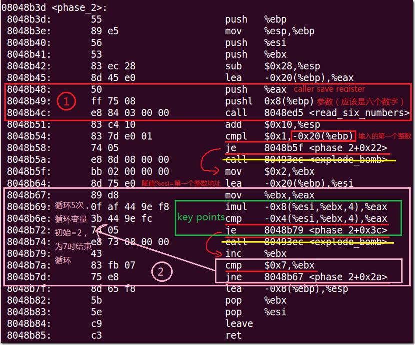

`Phase 3`<br>
是不是瞬间眼花了，真是越来越长了。不过粗略一看也能看出个所以然来，这么多这么整齐的jmp，没错，就是switch statements。
```asm
0000000000400ef9 <phase_3>:
  400ef9:	48 83 ec 18          	sub    $0x18,%rsp
  400efd:	48 8d 4c 24 08       	lea    0x8(%rsp),%rcx
  400f02:	48 8d 54 24 0c       	lea    0xc(%rsp),%rdx
  400f07:	be be 1e 40 00       	mov    $0x401ebe,%esi
  400f0c:	b8 00 00 00 00       	mov    $0x0,%eax
  400f11:	e8 9a fb ff ff       	callq  400ab0 <__isoc99_sscanf@plt>
  400f16:	83 f8 01             	cmp    $0x1,%eax
  400f19:	7f 05                	jg     400f20 <phase_3+0x27>
  400f1b:	e8 1d 07 00 00       	callq  40163d <explode_bomb>
  400f20:	83 7c 24 0c 07       	cmpl   $0x7,0xc(%rsp)
  400f25:	77 3c                	ja     400f63 <phase_3+0x6a>
  400f27:	8b 44 24 0c          	mov    0xc(%rsp),%eax
  400f2b:	ff 24 c5 60 1b 40 00 	jmpq   *0x401b60(,%rax,8)
  400f32:	b8 17 02 00 00       	mov    $0x217,%eax
  400f37:	eb 3b                	jmp    400f74 <phase_3+0x7b>
  400f39:	b8 d6 00 00 00       	mov    $0xd6,%eax
  400f3e:	eb 34                	jmp    400f74 <phase_3+0x7b>
  400f40:	b8 53 01 00 00       	mov    $0x153,%eax
  400f45:	eb 2d                	jmp    400f74 <phase_3+0x7b>
  400f47:	b8 77 00 00 00       	mov    $0x77,%eax
  400f4c:	eb 26                	jmp    400f74 <phase_3+0x7b>
  400f4e:	b8 60 01 00 00       	mov    $0x160,%eax
  400f53:	eb 1f                	jmp    400f74 <phase_3+0x7b>
  400f55:	b8 97 03 00 00       	mov    $0x397,%eax
  400f5a:	eb 18                	jmp    400f74 <phase_3+0x7b>
  400f5c:	b8 9c 01 00 00       	mov    $0x19c,%eax
  400f61:	eb 11                	jmp    400f74 <phase_3+0x7b>
  400f63:	e8 d5 06 00 00       	callq  40163d <explode_bomb>
  400f68:	b8 00 00 00 00       	mov    $0x0,%eax
  400f6d:	eb 05                	jmp    400f74 <phase_3+0x7b>
  400f6f:	b8 9e 03 00 00       	mov    $0x39e,%eax
  400f74:	3b 44 24 08          	cmp    0x8(%rsp),%eax
  400f78:	74 05                	je     400f7f <phase_3+0x86>
  400f7a:	e8 be 06 00 00       	callq  40163d <explode_bomb>
  400f7f:	48 83 c4 18          	add    $0x18,%rsp
  400f83:	c3                   	retq   
```
这次我们开始使用神器了，gdb一下，你会发现，轻松许多。使用之前，先大致浏览一下代码整体结构。

首先`400f11`处调用了一个系统函数`sscanf`。（不了解就man一下，反正跟scanf差不多，格式化读入）<br>
然后比较读入数据的个数是否大于1,是就跳转，不然爆炸。<br>
`400f20`，与7比较大小。<br>
`400f2b`，此处是关键，这里是一个switch跳转表，根据%rax的不同往不同地址跳，再下面就是跳转分支。<br>
最后，在`400f74`有一个比较，缘由后解。

打开gdb：`gdb --args bomb defuser.txt`<br>
目测`0x401ebe`为参数，先在`400f07`处设置断点，查看输入格式。


可以看到要求输入两个数字。其中第一个数字要小于7,第二个数字需要等于返回值%eax，这个自己看代码。<br>
这次我们在`400f2b`设断点，并将第一个数字设为0,看跳转到哪里，跟踪获取%eax的值。


当第一个数字为0时，`*0x401b60`指向地址`0x400f32`处，也就是跳转到该处，查看代码，`mov $0x217,%eax`，一个简单的赋值，然后就跳转结束了。<br>
可以得知，输入`0 535`通关。当然其它的情况你可以自己尝试。

下图是详细的程序流程：


switch跳转表：


`Phase 4`<br>
这一关的关键字是recursion，也就是递归迭代啦。
```asm
0000000000400fc1 <phase_4>:
  400fc1: 48 83 ec 18           sub    $0x18,%rsp
  400fc5: 48 8d 54 24 0c        lea    0xc(%rsp),%rdx
  400fca: be c1 1e 40 00        mov    $0x401ec1,%esi
  400fcf: b8 00 00 00 00        mov    $0x0,%eax
  400fd4: e8 d7 fa ff ff        callq  400ab0 <__isoc99_sscanf@plt>
  400fd9: 83 f8 01              cmp    $0x1,%eax
  400fdc: 75 07                 jne    400fe5 <phase_4+0x24>
  400fde: 83 7c 24 0c 00        cmpl   $0x0,0xc(%rsp)
  400fe3: 7f 05                 jg     400fea <phase_4+0x29>
  400fe5: e8 53 06 00 00        callq  40163d <explode_bomb>
  400fea: 8b 7c 24 0c           mov    0xc(%rsp),%edi
  400fee: e8 91 ff ff ff        callq  400f84 <func4>
  400ff3: 83 f8 37              cmp    $0x37,%eax
  400ff6: 74 05                 je     400ffd <phase_4+0x3c>
  400ff8: e8 40 06 00 00        callq  40163d <explode_bomb>
  400ffd: 48 83 c4 18           add    $0x18,%rsp
  401001: c3                    retq   
```
又是sscanf，与上例一样，`0x401ec1`传入格式化字符，不过这回不等于1就会爆炸，也就是只读入一个数据，并且值要大于0。
如果满足以上条件，将输入作为参数，调用函数func4，最后看返回值是否等于0x37。
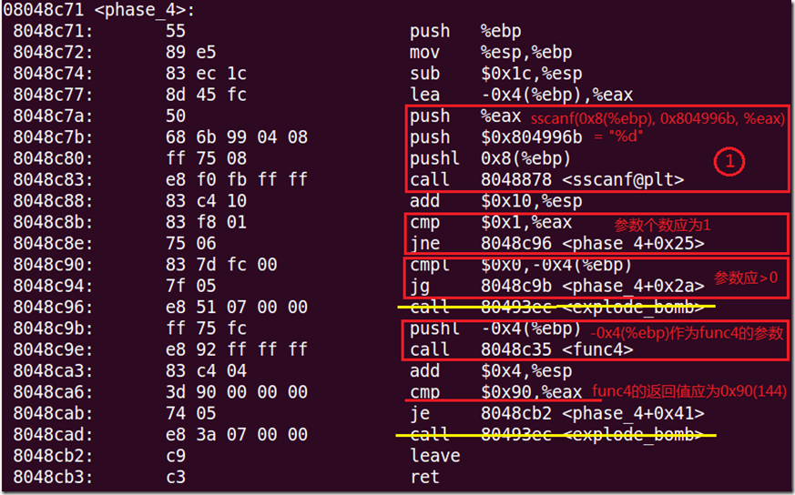
也就是说，接下来重点是看func4函数了。
```asm
0000000000400f84 <func4>:
  400f84: 48 89 5c 24 f0        mov    %rbx,-0x10(%rsp)
  400f89: 48 89 6c 24 f8        mov    %rbp,-0x8(%rsp)
  400f8e: 48 83 ec 18           sub    $0x18,%rsp
  400f92: 89 fb                 mov    %edi,%ebx
  400f94: b8 01 00 00 00        mov    $0x1,%eax
  400f99: 83 ff 01              cmp    $0x1,%edi
  400f9c: 7e 14                 jle    400fb2 <func4+0x2e>
  400f9e: 8d 7b ff              lea    -0x1(%rbx),%edi
  400fa1: e8 de ff ff ff        callq  400f84 <func4>
  400fa6: 89 c5                 mov    %eax,%ebp
  400fa8: 8d 7b fe              lea    -0x2(%rbx),%edi
  400fab: e8 d4 ff ff ff        callq  400f84 <func4>
  400fb0: 01 e8                 add    %ebp,%eax
  400fb2: 48 8b 5c 24 08        mov    0x8(%rsp),%rbx
  400fb7: 48 8b 6c 24 10        mov    0x10(%rsp),%rbp
  400fbc: 48 83 c4 18           add    $0x18,%rsp
  400fc0: c3                    retq   
```
还好这个函数不长，慢慢看的话都能看明白。就是一个计算斐波那契数列的函数，转化成c语言就是：
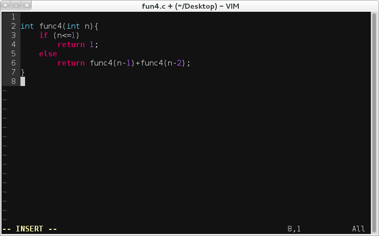
实在不理解看下图，这个就不解释了吧。
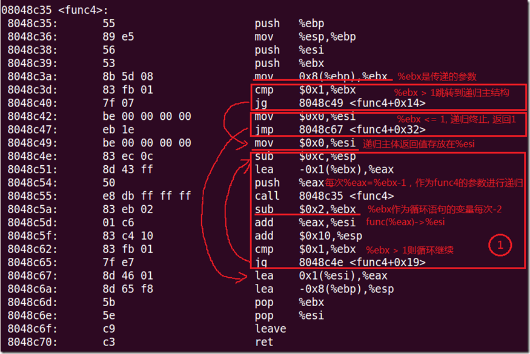
好了，函数也知道了，答案也就知道了，就是计算func(n)=0x37，n=9。

`Phase 5`<br>
这一关考验的是理解指针和数组的汇编。
```asm
0000000000401002 <phase_5>:
  401002: 48 83 ec 18           sub    $0x18,%rsp
  401006: 48 8d 4c 24 08        lea    0x8(%rsp),%rcx
  40100b: 48 8d 54 24 0c        lea    0xc(%rsp),%rdx
  401010: be be 1e 40 00        mov    $0x401ebe,%esi
  401015: b8 00 00 00 00        mov    $0x0,%eax
  40101a: e8 91 fa ff ff        callq  400ab0 <__isoc99_sscanf@plt>
  40101f: 83 f8 01              cmp    $0x1,%eax
  401022: 7f 05                 jg     401029 <phase_5+0x27>
  401024: e8 14 06 00 00        callq  40163d <explode_bomb>
  401029: 8b 44 24 0c           mov    0xc(%rsp),%eax
  40102d: 83 e0 0f              and    $0xf,%eax
  401030: 89 44 24 0c           mov    %eax,0xc(%rsp)
  401034: 83 f8 0f              cmp    $0xf,%eax
  401037: 74 2c                 je     401065 <phase_5+0x63>
  401039: b9 00 00 00 00        mov    $0x0,%ecx
  40103e: ba 00 00 00 00        mov    $0x0,%edx
  401043: 83 c2 01              add    $0x1,%edx
  401046: 48 98                 cltq   
  401048: 8b 04 85 a0 1b 40 00  mov    0x401ba0(,%rax,4),%eax
  40104f: 01 c1                 add    %eax,%ecx
  401051: 83 f8 0f              cmp    $0xf,%eax
  401054: 75 ed                 jne    401043 <phase_5+0x41>
  401056: 89 44 24 0c           mov    %eax,0xc(%rsp)
  40105a: 83 fa 0c              cmp    $0xc,%edx
  40105d: 75 06                 jne    401065 <phase_5+0x63>
  40105f: 3b 4c 24 08           cmp    0x8(%rsp),%ecx
  401063: 74 05                 je     40106a <phase_5+0x68>
  401065: e8 d3 05 00 00        callq  40163d <explode_bomb>
  40106a: 48 83 c4 18           add    $0x18,%rsp
  40106e: c3                    retq   
```
`0x401ebe`存放的是"%d %d"，接着sscanf读入。第一个数放在0xc(%rsp)里，要小于16，随即存入%eax，后面将作为数组索引用，第二个放在0x8(%rsp)，最后要与%edx对比。
下面是关键代码：
```asm
  401043:       83 c2 01                add    $0x1,%edx
  401046:       48 98                   cltq   
  401048:       8b 04 85 a0 1b 40 00    mov    0x401ba0(,%rax,4),%eax
  40104f:       01 c1                   add    %eax,%ecx
  401051:       83 f8 0f                cmp    $0xf,%eax
  401054:       75 ed                   jne    401043 <phase_5+0x41>
```
其中%edx作计数器，最后要等于12。`mov 0x401ba0(,%rax,4),%eax`将%eax的值作为数组索引其所指向的值再存入%eax中，而%ecx则计算这过程中所有%eax的和，直到%eax等于15为止（cltq指令是将32位扩展到64位）。
于是在`0x401048`处设置断点，把整个数组dump出来。
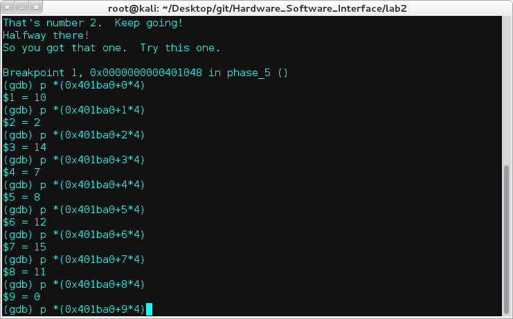
得到整条指向链：
`15->5->12->3->7->11->13>9->4->8->0->10->1->2->14->6->15`
所以答案是`7 93`。
下面这个版本的不一样，但原理相同，可以看看。
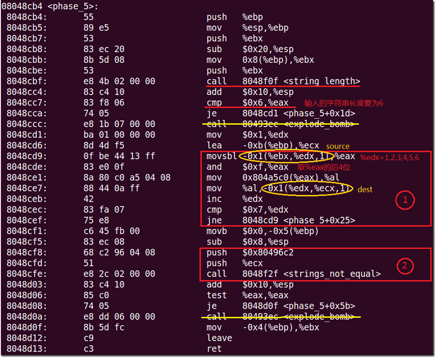

`Phase 6`<br>
最后一关了，心情小激动。
```asm
00000000004010d9 <phase_6>:
  4010d9: 48 83 ec 08           sub    $0x8,%rsp
  4010dd: ba 0a 00 00 00        mov    $0xa,%edx
  4010e2: be 00 00 00 00        mov    $0x0,%esi
  4010e7: e8 94 fa ff ff        callq  400b80 <strtol@plt>
  4010ec: 89 05 8e 16 20 00     mov    %eax,0x20168e(%rip)        # 602780 <node0>
  4010f2: bf 80 27 60 00        mov    $0x602780,%edi
  4010f7: e8 73 ff ff ff        callq  40106f <fun6>
  4010fc: 48 8b 40 08           mov    0x8(%rax),%rax
  401100: 48 8b 40 08           mov    0x8(%rax),%rax
  401104: 48 8b 40 08           mov    0x8(%rax),%rax
  401108: 8b 15 72 16 20 00     mov    0x201672(%rip),%edx        # 602780 <node0>
  40110e: 39 10                 cmp    %edx,(%rax)
  401110: 74 05                 je     401117 <phase_6+0x3e>
  401112: e8 26 05 00 00        callq  40163d <explode_bomb>
  401117: 48 83 c4 08           add    $0x8,%rsp
  40111b: c3                    retq   
```
现在看已经毫无压力了，strtol与atoi作用差不多，都是将字符串转为无符号整数。然后调用func6，将返回值与你输入的进行对比，不同就引爆bomb。
感觉很简单，那我们就去看func6。
```asm
000000000040106f <fun6>:
  40106f: 4c 8b 47 08           mov    0x8(%rdi),%r8
  401073: 48 c7 47 08 00 00 00  movq   $0x0,0x8(%rdi)
  40107a: 00 
  40107b: 48 89 f8              mov    %rdi,%rax
  40107e: 48 89 f9              mov    %rdi,%rcx
  401081: 4d 85 c0              test   %r8,%r8
  401084: 75 40                 jne    4010c6 <fun6+0x57>
  401086: 48 89 f8              mov    %rdi,%rax
  401089: c3                    retq   
  40108a: 48 89 d1              mov    %rdx,%rcx
  40108d: 48 8b 51 08           mov    0x8(%rcx),%rdx
  401091: 48 85 d2              test   %rdx,%rdx
  401094: 74 09                 je     40109f <fun6+0x30>
  401096: 39 32                 cmp    %esi,(%rdx)
  401098: 7f f0                 jg     40108a <fun6+0x1b>
  40109a: 48 89 cf              mov    %rcx,%rdi
  40109d: eb 03                 jmp    4010a2 <fun6+0x33>
  40109f: 48 89 cf              mov    %rcx,%rdi
  4010a2: 48 39 d7              cmp    %rdx,%rdi
  4010a5: 74 06                 je     4010ad <fun6+0x3e>
  4010a7: 4c 89 47 08           mov    %r8,0x8(%rdi)
  4010ab: eb 03                 jmp    4010b0 <fun6+0x41>
  4010ad: 4c 89 c0              mov    %r8,%rax
  4010b0: 49 8b 48 08           mov    0x8(%r8),%rcx
  4010b4: 49 89 50 08           mov    %rdx,0x8(%r8)
  4010b8: 48 85 c9              test   %rcx,%rcx
  4010bb: 74 1a                 je     4010d7 <fun6+0x68>
  4010bd: 49 89 c8              mov    %rcx,%r8
  4010c0: 48 89 c1              mov    %rax,%rcx
  4010c3: 48 89 c7              mov    %rax,%rdi
  4010c6: 48 89 ca              mov    %rcx,%rdx
  4010c9: 48 85 c9              test   %rcx,%rcx
  4010cc: 74 d4                 je     4010a2 <fun6+0x33>
  4010ce: 41 8b 30              mov    (%r8),%esi
  4010d1: 39 31                 cmp    %esi,(%rcx)
  4010d3: 7f b8                 jg     40108d <fun6+0x1e>
  4010d5: eb cb                 jmp    4010a2 <fun6+0x33>
  4010d7: f3 c3                 repz retq 
```
。。顿时吓尿了有木有，这么长，各种绕，各种看不懂，反正我是看不下去了。
那还有没有其他办法，这个嘛，当然有！
再回过头来看看，`0x4010f2`处传了一个硬编码地址的参数，什么，你没有看错，既然参数写死，好吧，返回值也是定值啦。呃，这么简单不科学！
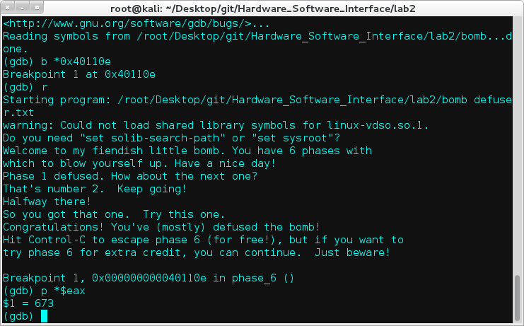
673出来了，啊哈哈。
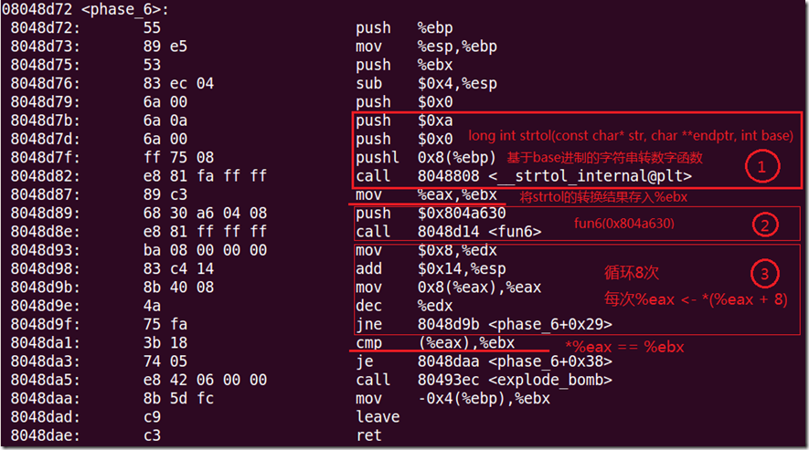

`Secret Phase`<br>
什么，居然还有隐藏关卡。。
```asm
000000000040115a <secret_phase>:
  40115a: 53                    push   %rbx
  40115b: e8 ff 04 00 00        callq  40165f <read_line>
  401160: ba 0a 00 00 00        mov    $0xa,%edx
  401165: be 00 00 00 00        mov    $0x0,%esi
  40116a: 48 89 c7              mov    %rax,%rdi
  40116d: e8 0e fa ff ff        callq  400b80 <strtol@plt>
  401172: 89 c3                 mov    %eax,%ebx
  401174: 8d 43 ff              lea    -0x1(%rbx),%eax
  401177: 3d e8 03 00 00        cmp    $0x3e8,%eax
  40117c: 76 05                 jbe    401183 <secret_phase+0x29>
  40117e: e8 ba 04 00 00        callq  40163d <explode_bomb>
  401183: 89 de                 mov    %ebx,%esi
  401185: bf a0 25 60 00        mov    $0x6025a0,%edi
  40118a: e8 8d ff ff ff        callq  40111c <fun7>
  40118f: 83 f8 03              cmp    $0x3,%eax
  401192: 74 05                 je     401199 <secret_phase+0x3f>
  401194: e8 a4 04 00 00        callq  40163d <explode_bomb>
  401199: bf 28 1b 40 00        mov    $0x401b28,%edi
  40119e: e8 fd f8 ff ff        callq  400aa0 <puts@plt>
  4011a3: e8 dd 05 00 00        callq  401785 <phase_defused>
  4011a8: 5b                    pop    %rbx
  4011a9: c3                    retq   
  4011aa: 90                    nop
  4011ab: 90                    nop
  4011ac: 90                    nop
  4011ad: 90                    nop
  4011ae: 90                    nop
  4011af: 90                    nop
```
真的有耶，可是怎么进去呢，入口在哪？
于是全文搜索，发现隐藏在`phase_defused`中，也就是每次过关时执行的函数。
```asm
0000000000401785 <phase_defused>:
  401785: 48 83 ec 68           sub    $0x68,%rsp
  401789: 83 3d f0 14 20 00 06  cmpl   $0x6,0x2014f0(%rip)        # 602c80 <num_input_strings>
  401790: 75 5e                 jne    4017f0 <phase_defused+0x6b>
  401792: 48 8d 4c 24 10        lea    0x10(%rsp),%rcx
  401797: 48 8d 54 24 0c        lea    0xc(%rsp),%rdx
  40179c: be c4 1e 40 00        mov    $0x401ec4,%esi
  4017a1: bf 30 30 60 00        mov    $0x603030,%edi
  4017a6: b8 00 00 00 00        mov    $0x0,%eax
  4017ab: e8 00 f3 ff ff        callq  400ab0 <__isoc99_sscanf@plt>
  4017b0: 83 f8 02              cmp    $0x2,%eax
  4017b3: 75 31                 jne    4017e6 <phase_defused+0x61>
  4017b5: be ca 1e 40 00        mov    $0x401eca,%esi
  4017ba: 48 8d 7c 24 10        lea    0x10(%rsp),%rdi
  4017bf: e8 79 fa ff ff        callq  40123d <strings_not_equal>
  4017c4: 85 c0                 test   %eax,%eax
  4017c6: 75 1e                 jne    4017e6 <phase_defused+0x61>
  4017c8: bf 40 1c 40 00        mov    $0x401c40,%edi
  4017cd: e8 ce f2 ff ff        callq  400aa0 <puts@plt>
  4017d2: bf 68 1c 40 00        mov    $0x401c68,%edi
  4017d7: e8 c4 f2 ff ff        callq  400aa0 <puts@plt>
  4017dc: b8 00 00 00 00        mov    $0x0,%eax
  4017e1: e8 74 f9 ff ff        callq  40115a <secret_phase>
  4017e6: bf a0 1c 40 00        mov    $0x401ca0,%edi
  4017eb: e8 b0 f2 ff ff        callq  400aa0 <puts@plt>
  4017f0: 48 83 c4 68           add    $0x68,%rsp
  4017f4: c3                    retq   
  4017f5: 90                    nop
  4017f6: 90                    nop
  4017f7: 90                    nop
  4017f8: 90                    nop
  4017f9: 90                    nop
  4017fa: 90                    nop
  4017fb: 90                    nop
  4017fc: 90                    nop
  4017fd: 90                    nop
  4017fe: 90                    nop
  4017ff: 90                    nop
```
`cmpl $0x6,0x2014f0(%rip)`如果小于6直接跳过，也就是说只会在第六关执行。
```
1ec4 %d %s
1eca austinpowers
```
可以看到sscanf要读入一个数字和字符串，并且后面这个字符串要等于`0x4001eca`的"austinpowers"，可是根本就没有让我们输入啊，因为`mov $0x603030,%edi`已经传好了。
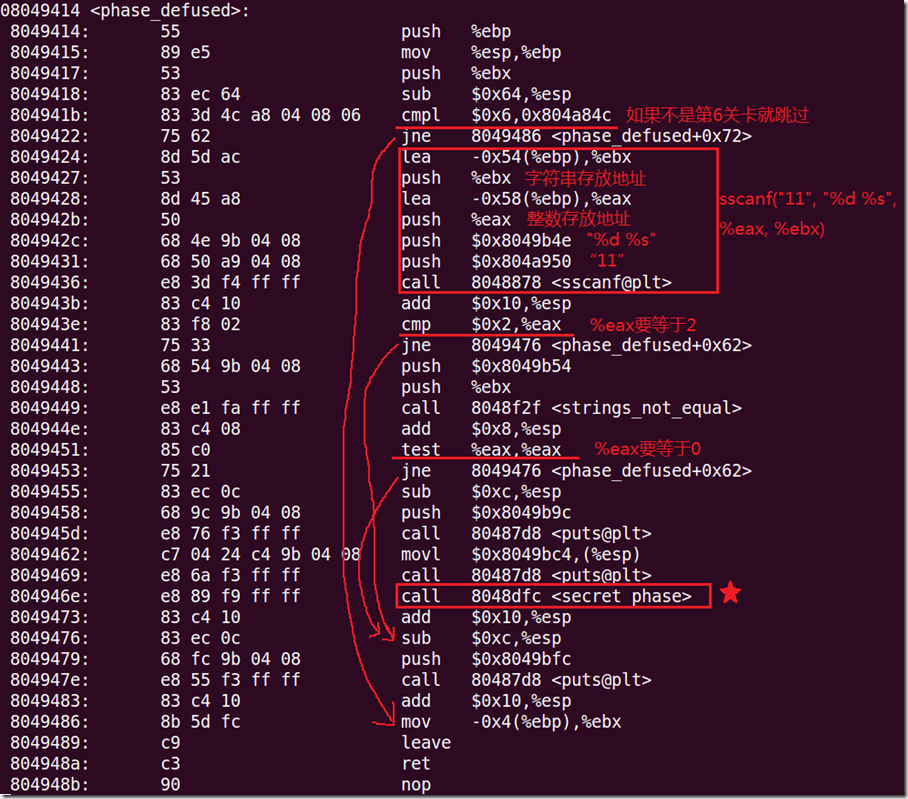
所以要进入隐藏关，需手动修改寄存器的值。
你可以修改%edi，加入那个关键的keyword，但我就不麻烦了，直接就在每次cmp之前修改寄存器使之相等，这不是耍流氓吗。。
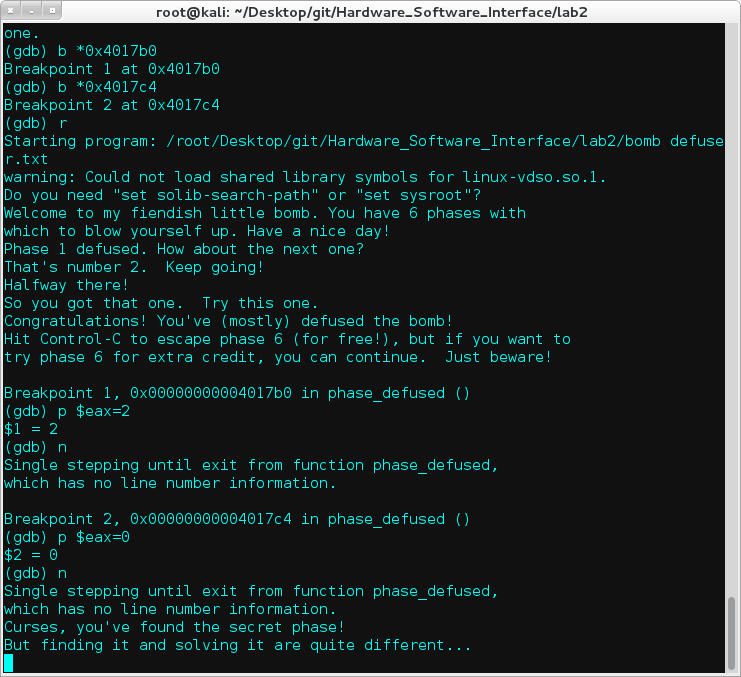
成功进去了，哦哦。
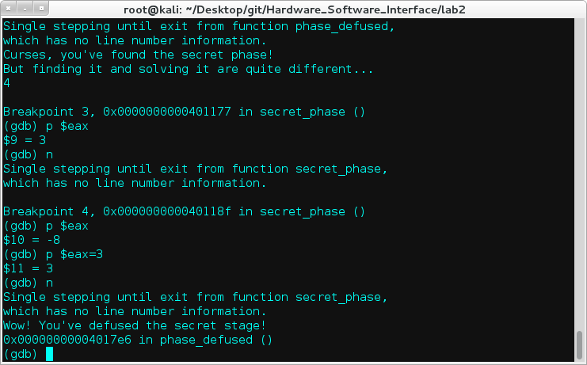
一路耍流氓。。好吧，我也觉得过意不去，还是看看func7吧。。
```asm
000000000040111c <fun7>:
  40111c: 48 83 ec 08           sub    $0x8,%rsp
  401120: 48 85 ff              test   %rdi,%rdi
  401123: 74 2b                 je     401150 <fun7+0x34>
  401125: 8b 17                 mov    (%rdi),%edx
  401127: 39 f2                 cmp    %esi,%edx
  401129: 7e 0d                 jle    401138 <fun7+0x1c>
  40112b: 48 8b 7f 08           mov    0x8(%rdi),%rdi
  40112f: e8 e8 ff ff ff        callq  40111c <fun7>
  401134: 01 c0                 add    %eax,%eax
  401136: eb 1d                 jmp    401155 <fun7+0x39>
  401138: b8 00 00 00 00        mov    $0x0,%eax
  40113d: 39 f2                 cmp    %esi,%edx
  40113f: 74 14                 je     401155 <fun7+0x39>
  401141: 48 8b 7f 10           mov    0x10(%rdi),%rdi
  401145: e8 d2 ff ff ff        callq  40111c <fun7>
  40114a: 8d 44 00 01           lea    0x1(%rax,%rax,1),%eax
  40114e: eb 05                 jmp    401155 <fun7+0x39>
  401150: b8 ff ff ff ff        mov    $0xffffffff,%eax
  401155: 48 83 c4 08           add    $0x8,%rsp
  401159: c3                    retq   
```
func7有两个参数，一个是整形指针%rdi，一个整数%esi。下面是还原的c代码：
```c
int fun7(const int *a, int b)
{
  if (a == NULL)
    return -1;
  int ret = 0;
  if (*a - b > 0)
  {
    ret = fun7(*(a + 4), b);
    ret *= 2
  }
  else if (*a - b == 0)
    return 0;
  else
  {
    ret = fun7(*(a + 8), b);
    ret = ret * 2 + 1;
  }
  return ret;
}
```
再附上详解大图：


写在最后
--------
我只能说，这课和吴恩达的机器学习，号称C站上的两大神课。

###注明：
本文中有部分图片出自他人博客，也参考了其内容，原文看[这里](http://www.cnblogs.com/remlostime/archive/2011/05/21/2052708.html)<br>
转载本文请注明出处，尊重作者劳动成果，谢谢。
